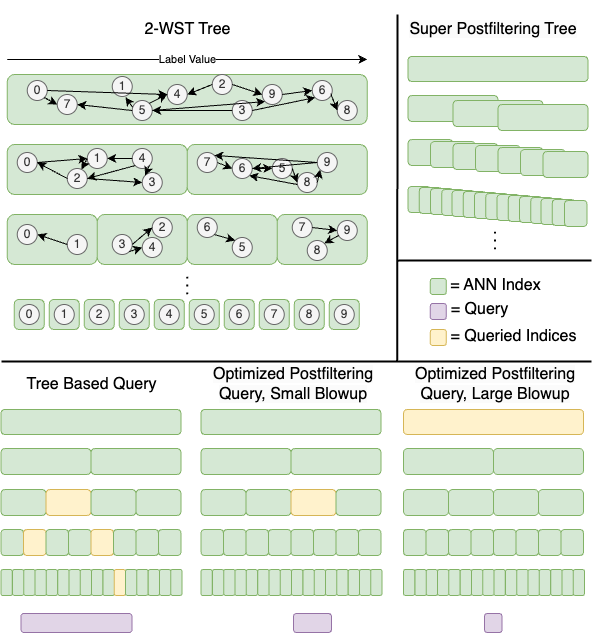

# Window Search
This repository contains code to do window search. This is a generalization of approximate nearest neighbor search where every point has a numeric label and the goal is to find the approximate nearest neighbors to a query point that has a label within an arbitrary numeric range. This problem has applications to many natural search problems, including image search (e.g. search over CLIP embeddings where a user wishes to filter by timestamp), product search (e.g. search over semantic product embeddings where a user wishes to filter by cost), and large language model retrieval augmented generation (e.g. if an LLM wishes to retrieve stored documents or previous text generated and filter by timestamp).

# Our Algorithms

The high level approach we take is to partition the dataset into a large number of traditional ANN indices. 

We define a novel data structure we call a B-Window Search Tree, which continually recursively partitions the dataset sorted by label values into B groups. To search a B-WST, we query a (logarithmic number) of ANN indices whose label ranges union together to equal the query label range.

Another way to search is a B-Window Search Tree is through a method we call *optimized postfiltering*. Given a query with a specified label range, we find the smallest partition in the tree that entirely contains the query label range, and then query an exponentially increasing number of points from that ANN index until enough of the points that meet the filter constraint are returned. 

One problem with optimized postfiltering is that queries can have a large blowup, which means that the smallest partition containing a label range is much larger than the number of points that meet the filter constraint. To solve this, we introduce another method called *super postfiltering*, which constructs indices that have overlapping label ranges. 

The figure below visualizes some of these ideas. The top left is a 2-WST. Each index contains a recursive partition of the entire dataset D, indexed into a graph for fast ANN. The top right shows the structure of an example label space partitioning method that ensures no optimized postfiltering query will have a large blowup. The bottom shows different query methods; from left to right: a tree-based query, an optimized postfiltering query with a small blowup, and an optimized postfiltering query with a large blowup.



For more detailed descriptions of these ideas, see our paper.

# Using Our Package

Our package can be installed by running
```
pip3 install .
```

To see basic usage of our package, see the experiment script `experiments/run_our_method.py`. Note that if you wish to use our package in a different folder, you will need to copy the `experiments/wrapper.py` file; we plan to integrate this into the pip package soon so that this will not be necessary.

# Reproducing Experiments

Below we describe how to reproduce the experiments from our paper. 

## Datasets

We experiment on 5 datasets, denoted by SIFT, GloVe, deep, RedCaps, and adverse. For each dataset, we create the following files:
1. The data: a `<dataset>.npy` file
2. The query vectors: a `<dataset>_queries.npy` file
3. The data filters: a `<dataset>_filter-values.npy` file
4. 17 query window filter files and corresponding ground truth files, corresponding to filter fractions `2**i for i in [-16, 0]`: `<dataset>_queries_2pow<i>_ranges.npy` and `<dataset>_queries_2pow<i>_gt.npy`  

SIFT, GloVe, and deep are augmentations of datasets from [ANN benchmarks](https://github.com/erikbern/ann-benchmarks/tree/main). To generate them, you can run 
```
cd generate_datasets
generate_ann_benchmarks_datasets.py <output_dir> sift 
generate_ann_benchmarks_datasets.py <output_dir> glove 
generate_ann_benchmarks_datasets.py <output_dir> deep1b 
```

RedCaps is an augmentation of the [RedCaps](https://redcaps.xyz/) dataset. We download it using the [RedCaps downloader](https://github.com/redcaps-dataset/redcaps-downloader). Getting the redcaps dataset can take a while, and in the future we plan to host a copy of the embeddings. Until then, to create all of the redcaps image embeddings, you can run:
```
cd <your choice of working directory>
git clone https://github.com/redcaps-dataset/redcaps-downloader
cp <path_to_repo>/RangeFilteredANN/generate_datasets/download_redcaps.py .
python3 download_redcaps.py
```
The final redcaps dataset and embeddings can be generated by running
```
cd generate_datasets
python3 generate_redcaps_data.py
python3 generate_redcaps_filters.py
```
You may need to change the input and output locations, where are hardcoded in the script.
The redcaps query embeddings are included in this repository under `artifacts/redcaps-512-angular-queries.npy`.

The adverse dataset can be generated by running
```
cd generate_datasets
python3 generate_adversarial_dataset.py <output_dir>
```


## Running Experiments

### Recall vs. QPS

Once the datasets are generated, you can run all of our Recall vs. QPS experiments by running
```
cd experiments
python3 run_our_method.py --all --threads <num_threads> > output.txt
```
There are a number of other additional parameters you can pass to `run_our_method.py` to customize which algorithms to run and what hyperparameters to run them with. You may need to change the hardcoded dataset directories. The `output.txt` file will contain the build times for each algorithm on each dataset. 

You can additionally run the Milvus and MS-VBASE baselines by following the steps in `experiments/README`, and then running
```
cd experiments
python3 run_milvus.py
python3 run_msvbase.py
```
You again may need to change the hardcoded dataset directories.

You can plot results by running
```
cd experiments
python3 plot.py
python3 plot_adversarial.py
```
and you can generate the "improvement" tables from our paper by running
```
cd experiments
python3 create_table.py
```

### Memory Footprint Experiments

Once you have run all of the above experiments, the indices will be saved in experiments/index_cache. You can then run the memory footprint experiment by running
```
cd experiments
./run_all_memories.sh
```

### Varying B Experiments

You can run the experiments that vary B in the B-WST tree by modifying `VAMANA_TREE_SPLIT_FACTORS` to be `[2, 4, 8, 16, 32, 64, 128]` in `experiments/run_our_method.py` and then running
```
cd experiments
python3 run_our_method.py --vamana_tree
```
You can plot the effects of varying b by running the jupyter notebook `b_plot.ipynb`.

 